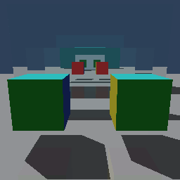
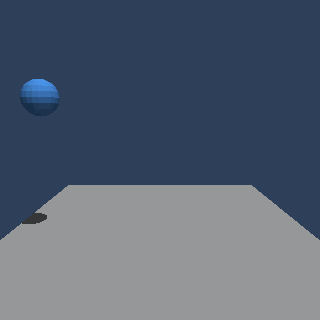
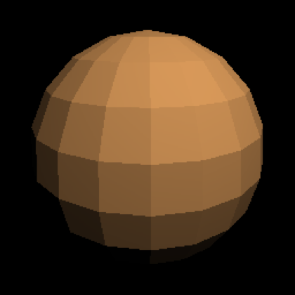

# GPU Runtime Simulator

A software GPU runtime simulator written in C++17. It implements a SIMT
execution model, a custom Virtual ISA, and a Runtime API from scratch, and then
draws with them: a rasteriser and a ray tracer, both written as kernels for the
same simulated machine, checked against each other pixel for pixel.

> **Portfolio goal**: to demonstrate a developer who understands the rendering
> pipeline from top to bottom. Built for system semiconductor SW roles.

There is no fixed-function hardware anywhere in it. Rasterisation, traversal and
shading are all instructions the warp scheduler issues, which is what makes the
cost of a warp disagreeing with itself something this project can charge and
report rather than something it has to assume.

---

## Gallery

Every image here is produced by a committed program from committed assets, and
every one of them went through the same warp scheduler.

<table>
<tr>
<td width="50%"></td>
<td width="50%"></td>
</tr>
<tr>
<td><b>1024x1024, six bounces, shadow rays.</b> Two mirrors facing each other, so a
reflection contains another; a glass pane behind the cubes bending what stands
against the far wall; a shadow ray at every bounce asking what stands between
the surface and the light. Four minutes a frame.</td>
<td><b>The same room, 256x256 over 36 frames.</b> Written straight out as a GIF —
LZW and a median-cut palette, both in <code>apps/gif.hpp</code>, no image library.</td>
</tr>
<tr>
<td></td>
<td></td>
</tr>
<tr>
<td><b>Arcs solved step by step, not in closed form</b> — a bounce has no formula
that carries across it. Traced with a material a triangle, so the ball casts.</td>
<td><b>A cube through the rasteriser</b>, coloured by a fragment shader that is a
C++ callable emitting instructions as the kernel is built.</td>
</tr>
<tr>
<td></td>
<td></td>
</tr>
<tr>
<td><b>Where it started.</b> Moller-Trumbore with 24 registers assigned by hand,
before there was an IR builder. The colours are barycentric coordinates, so each
vertex resolves to a pure primary and an intersection error shows as a wrong
gradient rather than disappearing into flat shading.</td>
<td><b>An .obj down every route.</b> <code>mesh_render</code> draws the same mesh
through the walk, the tiled walk, shared-memory staging and the ray tracer, then
compares the four frames pixel for pixel.</td>
</tr>
</table>

```
$ ./build/apps/ray_triangle 256 256
rendering 256x256 - 65536 pixels, 2048 blocks of 32 threads
[STATS] divergence: 2.6%, throughput: 0.20 GIOPS
```

Divergence is concentrated at the triangle's edges, where a warp's 32 lanes
disagree about whether they hit. It falls as resolution rises — 10.1% at 64x64
against 2.6% here — because the interior grows with the area while the edge
grows only with the perimeter.

---

## What you can do with it

**Draw one frame four ways and hold the results against each other.** A pixel
walk, the same walk with triangles binned into tiles, the tiles staged through
shared memory, and a ray tracer that projects nothing. They are different
arithmetic — edge functions against Moller-Trumbore — and their frames are
byte-identical, which is the check no one of them can make alone.

**Write a shader.** A fragment shader here is a C++ callable that runs once, as
the kernel is assembled, and emits instructions. The whole instruction set is
available to it, branches included, and what it emits is charged in the same
divergence and throughput figures as the rasteriser around it.
→ [writing a program](docs/writing-a-program.md)

**Turn a cost model on and watch a conclusion move.** Coalescing, an L1/L2
cache, instruction latency and a bandwidth ceiling are each a flag, each off by
default, so every published figure stands as taken. Several conclusions reverse
when one is switched on, and those reversals are the most interesting results
here. → [what the optimisations bought](docs/findings.md)

**Ask a hardware question and get a number.** Whether a tree beats a linear
scan, what reordering a block's threads is worth, what a second queue buys, what
a warp shuffle saves over shared memory, when predication loses to a branch.
→ [the programs](docs/benchmarks.md) · [RESULTS.md](test/benchmark/RESULTS.md)

---

## Architecture

```
  ┌──────────────────────────────────────────────────┐
  │         Apps  (the programs with a main)         │
  │   ray_triangle · raster_triangle · mesh_render   │
  │               hello_shader · orbit               │
  │     two renderers, one frame, and they agree     │
  └────────────────────┬─────────────────────────────┘
                       │  Mesh · Camera · two launches
  ┌────────────────────▼─────────────────────────────┐
  │              Graphics Pipeline                   │
  │        gpurt/pipeline/ · gpurt/math3d.hpp        │
  │   vertex stage → tile binning → raster stage     │
  │   host-side Float3 / Float4x4, staged in shared  │
  └────────────────────┬─────────────────────────────┘
                       │  emits a Program
  ┌────────────────────▼─────────────────────────────┐
  │                  IR Builder                      │
  │               gpurt/ir_builder.hpp               │
  │   typed registers · allocation · branch patching │
  └────────────────────┬─────────────────────────────┘
                       │  myrt_launch(kernel, grid, block, args)
  ┌────────────────────▼─────────────────────────────┐
  │                 Runtime API                      │
  │                gpurt/runtime.hpp                 │
  │   malloc / memcpy / launch / stream / sync       │
  └──────┬───────────────────────────────────────────┘
         │  delegates warp execution
  ┌──────▼───────────────────────────────────────────┐
  │              Warp Scheduler                      │
  │               gpurt/scheduler.hpp                │
  │   SMs · residency · round-robin · divergence     │
  └──────┬───────────────────────────────────────────┘
         │  executes instructions per warp
  ┌──────▼───────────────────────────────────────────┐
  │          Thread / Warp Structure                 │
  │                 gpurt/thread.hpp                 │
  │   Thread[256 regs, pc, active]                   │
  │   Warp[32 threads, activeMask]                   │
  │   ThreadBlock[warps, 4096 floats shared]         │
  └──────┬───────────────────────────────────────────┘
         │  instruction fetch & decode
  ┌──────▼───────────────────────────────────────────┐
  │               Virtual ISA                        │
  │                  gpurt/isa.hpp                   │
  │   Opcode · Instruction · Program                 │
  │   45 opcodes, 8 bytes each                       │
  │   V_MUL_F32 / V_DOT_VEC3_F32 / V_MATVEC_MAT4_F32 │
  │   V_LD_GLOBAL_F32 / V_CP_ASYNC_SHARED_GLOBAL_F32 │
  │   S_BALLOT / S_SYNCWARP / V_SHUFFLE_F32          │
  │   V_CMP_F32 / BRA_DIV / BARRIER / RET            │
  └──────┬───────────────────────────────────────────┘
         │  physical memory access
  ┌──────▼───────────────────────────────────────────┐
  │               Memory Model                       │
  │                 gpurt/memory.hpp                 │
  │   Host / Device (separate address spaces)        │
  │   free-list allocation                           │
  └──────────────────────────────────────────────────┘
```

---

## Build and run

GoogleTest is fetched automatically on the first configure.

```bash
scripts/build.sh             # configure if needed, then build
scripts/build.sh --clean     # discard build/ and start over
scripts/build.sh --release   # with optimisations

scripts/test.sh              # build, then run every test
scripts/test.sh Scheduler    # only tests whose name matches

scripts/format.sh            # apply .clang-format in place
scripts/format.sh --check    # list unformatted files, exit 1

scripts/check.sh             # all three gates, as CI would run them
```

`scripts/test.sh` builds before running, because `ctest` on its own executes
whatever binaries are already in `build/` — after an edit that can report on
code which was never compiled.

The equivalent CMake invocations still work (`cmake -B build`, `ctest`,
`--target format`), but the scripts also recover from a `build/` directory left
behind by a different generator, which otherwise blocks configuring while
leaving the stale binaries in place.

Three to start with:

```bash
./build/apps/hello_shader                       # a shader of your own, in ~80 lines
./build/apps/orbit --shape mirror --frames 1    # the reflection room, as a still
./build/test/benchmark/divergence_bench         # what a warp disagreeing costs
```

Everything writes into `test/benchmark/output/` — tables beside it, images and
animations under `images/`. The full list of programs, and the question each one
asks, is in [docs/benchmarks.md](docs/benchmarks.md).

### Formatting

Layout is decided by `.clang-format`, never by hand. The config is derived from
the style already in the tree: 4-space indent, 90-column limit, function braces
on their own line, `int* ptr`.

---

## Tech stack

- **Language**: C++17 (`-std=c++17`, no compiler extensions)
- **Build**: CMake 3.16+
- **Tests**: GoogleTest (pinned to v1.17.0 via `FetchContent`)
- **Output format**: PPM for stills, GIF for animations — both written out by
  hand (`apps/ppm.hpp`, `apps/gif.hpp`), so the project has no image dependency
- **Dependencies**: none beyond the standard library and GoogleTest

---

## Key metrics

| Metric | Value |
|--------|-------|
| Warp divergence rate (ray kernel, 256x256) | 2.6% |
| Warp divergence rate (64x64) | 10.1% |
| Issue overhead once a warp splits | 1.80x |
| Rasteriser, tile binning | **-85%** issued work |
| Rasteriser, staged through shared memory | **-96%** against the naive walk |
| Vertex stage, indexed (cube: 8 vertices, not 36) | **-76%** |
| Predication against the branch (raster / ray) | **+2%** / **+4.4%** per lane, **+47%** / **+93%** per line |
| Warp reduction, exchange against shared memory | **33** instructions against 68 |
| Charging memory by the line, not the lane | **-93%**, and staging stops winning |
| A cache over the same scenes | **-40%**, flat — L2 is never outgrown here |
| Latency covered by 16 warps against 1 | **45 → 6** cycles a warp |
| Ordering a mesh for a cache smaller than it | **-25%** cycles, **-1.6%** issued work |
| A second draw of resident geometry | **192 → 0** misses, and 0.04% of the bill |
| Depth prepass against a single pass | **+30%** lit, **+98%** unlit — it needs a shader 1.85x dearer |
| Sixteen SMs of eight blocks against one of one | **60x** fewer cycles, same work to half a percent |
| Shared-memory staging's occupancy | **pinned at one block an SM** — it declares the whole scratchpad |
| A wide load for the ray tracer's vertices | **-25%** transactions, **-49%** cycles |
| Opcodes | 45 |
| Tests | 408 |

### What divergence costs

`divergence_bench` holds the work constant and varies only how a
warp splits.

```
  lanes | divergence | warp steps | issue | useful ops
  ------|------------|------------|-------|------------
   0/32 |      0.00% |      25600 | 1.00x |     819200
   1/32 |     44.51% |      46080 | 1.80x |     818176
  16/32 |     45.56% |      46080 | 1.80x |     802816
  31/32 |     46.60% |      46080 | 1.80x |     787456
  32/32 |      0.00% |      24576 | 0.96x |     786432
```

One lane taking the branch costs exactly what sixteen do. Both sides get issued
separately either way, and a warp step buys 32 lane slots whether one lane fills
them or all of them. Both extremes read 0%: **divergence is not about branching,
but about disagreeing.**

The issue column counts what the scheduler had to put through, so it is
identical on any machine. Wall-clock throughput is reported too, but it measures
this simulator on this host — where a masked lane is skipped outright and so
genuinely costs less, while hardware would keep its ALU busy regardless.

The full case studies behind these numbers — the index-buffer trade, why
predication loses, what a cache changed — are in
[docs/findings.md](docs/findings.md).

---

## What this models, and what it does not

A real GPU runs graphics through a chain of fixed-function blocks with two
programmable stages wired into it. This simulator has no fixed-function blocks
at all, which makes it a **compute-based software renderer on a simulated SIMT
machine** — the family Larrabee, CUDA rasterisation research and Nanite's
software path belong to — rather than a model of a graphics ASIC. That is a
deliberate position: a simulated fixed-function rasteriser would have nothing to
say about warp divergence, which is the thing this project exists to measure.

Block by block — what is built, what is partial, what is absent and why, and
where it goes next — is in **[docs/scope.md](docs/scope.md)**. The three
absences that matter most:

- **Bandwidth contention.** Transactions are counted, never queued for a shared
  resource.
- **Instruction-level parallelism.** Issue is in order with no scoreboard, so
  occupancy is the only thing that covers a wait. The sharpest figure in this
  repository rests on that.
- **Sampling.** One ray a surface and no randomness — a Whitted tracer, so
  shadows are hard-edged and there is no indirect diffuse.

---

## Layout

```
gpu-runtime-sim/
├── .clang-format
├── CMakeLists.txt
├── docs/                    # the documents this README links to, and its images
├── scripts/                 # build / test / bench / format / check
├── assets/                  # meshes the benchmarks and tests render
├── machines/                # a machine a benchmark can be pointed at
│   ├── default.spec  one-sm.spec  four-sm.spec  v100.spec  a100.spec
├── gpurt/                   # the library: a header and its source side by side
│   ├── isa.hpp / .cpp           Opcode, Instruction, Program
│   ├── memory.hpp / .cpp        host and device, separate address spaces
│   ├── thread.hpp / .cpp        Thread, Warp, ThreadBlock
│   ├── scheduler.hpp / .cpp     SMs, residency, divergence, the cost model
│   ├── runtime.hpp / .cpp       malloc / memcpy / launch / stream / sync
│   ├── ir_builder.hpp / .cpp    typed registers, branch patching
│   ├── gpu_spec.hpp / .cpp      the machine in one place
│   ├── app_run.hpp / .cpp       --out and run directories
│   ├── math3d.hpp / .cpp        Float3, Float4x4, Camera
│   ├── half.hpp / .cpp          f16 conversion, written out by hand
│   ├── mesh.hpp / .cpp          load_obj, ACMR scoring, Forsyth reorder
│   ├── bvh.hpp / .cpp           a tree over triangles, and one over instances
│   ├── gemm.hpp / .cpp          a tiled matrix multiply
│   └── pipeline/                the graphics layer, a header a stage
│       ├── types.hpp            strides, Fragment, Vertex, the callbacks
│       ├── vertex.*             pass 1
│       ├── raster.*             pass 2
│       ├── raster_tiled.*       tile binning and shared-memory staging
│       ├── raster_emit.hpp      private: what the raster kernels share
│       ├── raytrace.*           traversal, bounces, deferred shading
│       ├── clip.*               near-plane clipping
│       ├── cull.*               frustum culling and the grid it writes
│       ├── swap_chain.*         two frames
│       └── draw.*               the routes end to end
├── apps/                    # the programs with a main()
│   ├── ppm.hpp  gif.hpp         a still and an animation, both written out
│   ├── hello_shader.cpp         the shortest program with a shader of its own
│   ├── orbit.cpp                the short animations, and the mirror scene
│   ├── ray_triangle.cpp         registers assigned by hand, before IRBuilder
│   ├── raster_triangle.cpp      the same picture through the pipeline
│   └── mesh_render.cpp          an .obj down every route, compared
└── test/
    ├── unit/                # GoogleTest, a file a layer
    │   ├── test_isa.cpp  test_memory.cpp  test_thread.cpp
    │   ├── test_scheduler.cpp  test_streams.cpp  test_runtime.cpp
    │   ├── test_ir_builder.cpp  test_math3d.cpp  test_mesh.cpp
    │   ├── test_bvh.cpp  test_cull.cpp  test_gemm.cpp  test_gif.cpp
    │   ├── test_pipeline.cpp
    │   └── reference.hpp / .cpp   host oracles, in the test target only
    └── benchmark/
        ├── RESULTS.md       # the measurement record
        ├── src/             # a program a question
        │   ├── scenes.hpp   the scenes render_bench and model_bench share
        │   ├── divergence_bench.cpp  render_bench.cpp  reduction_bench.cpp
        │   ├── cache_bench.cpp  model_bench.cpp  occupancy_bench.cpp
        │   ├── stream_bench.cpp  async_bench.cpp  mma_bench.cpp
        │   ├── ser_bench.cpp  cluster_bench.cpp  gemm_bench.cpp
        │   ├── bandwidth_bench.cpp  bvh_bench.cpp  instance_bench.cpp
        │   └── tlas_bench.cpp  material_bench.cpp  cull_bench.cpp
        └── output/          # everything a run writes: images, GIFs, csv, md
```

---

## Further reading

| | |
|---|---|
| [docs/isa.md](docs/isa.md) | the instruction set: the naming scheme, and what each group of opcodes bought |
| [docs/writing-a-program.md](docs/writing-a-program.md) | how a rendering program is put together, and how to write a shader |
| [docs/benchmarks.md](docs/benchmarks.md) | every program, and the question each one asks |
| [docs/findings.md](docs/findings.md) | what the optimisations bought, in full, with the measurements |
| [docs/scope.md](docs/scope.md) | what is modelled and what is not, block by block, and where it goes next |
| [test/benchmark/RESULTS.md](test/benchmark/RESULTS.md) | the measurement record, the method, and the predictions that were wrong |
