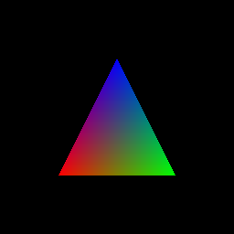

# GPU Runtime Simulator

A software GPU runtime simulator written in C++17. It implements a SIMT
execution model, a custom Virtual ISA, and a Runtime API from scratch, using a
Ray-Triangle intersection kernel as the validation workload.

> **Portfolio goal**: to demonstrate a developer who understands the rendering
> pipeline from top to bottom. Built for system semiconductor SW roles.



256x256, one thread per pixel, Möller-Trumbore intersection written in the
project's own instruction set and executed by its own warp scheduler. The
colours are the barycentric coordinates, so each vertex resolves to a pure
primary — an intersection error shows up as a wrong gradient rather than
disappearing into flat shading.

```
$ ./build/kernels/ray_triangle 256 256
rendering 256x256 — 65536 pixels, 2048 blocks of 32 threads
[STATS] divergence: 2.6%, throughput: 0.20 GIOPS
```

Divergence is concentrated at the triangle's edges, where a warp's 32 lanes
disagree about whether they hit. It falls as resolution rises — 10.1% at 64x64
against 2.6% here — because the interior grows with the area while the edge
grows only with the perimeter.

---

## Architecture

```
  ┌──────────────────────────────────────────────────┐
  │        Kernels  (validation workloads)           │
  │  ray_triangle · raster_triangle · mesh_render    │
  │   Möller–Trumbore   ·  edge functions            │
  │       all render to PPM, and must agree          │
  └────────────────────┬─────────────────────────────┘
                       │  Mesh · Camera · two launches
  ┌────────────────────▼─────────────────────────────┐
  │              Graphics Pipeline                   │
  │       include/pipeline/ · include/math3d.hpp     │
  │   vertex stage → tile binning → raster stage     │
  │   host-side Float3 / Float4x4, staged in shared  │
  └────────────────────┬─────────────────────────────┘
                       │  emits a Program
  ┌────────────────────▼─────────────────────────────┐
  │                  IR Builder                      │
  │              include/ir_builder.hpp              │
  │   typed registers · allocation · branch patching │
  └────────────────────┬─────────────────────────────┘
                       │  myrt_launch(kernel, grid, block, args)
  ┌────────────────────▼─────────────────────────────┐
  │                 Runtime API                      │
  │              include/runtime.hpp                 │
  │   malloc / memcpy / launch / stream / sync       │
  └──────┬───────────────────────────────────────────┘
         │  delegates warp execution
  ┌──────▼───────────────────────────────────────────┐
  │              Warp Scheduler                      │
  │            include/scheduler.hpp                 │
  │   SMs · residency · round-robin · divergence     │
  └──────┬───────────────────────────────────────────┘
         │  executes instructions per warp
  ┌──────▼───────────────────────────────────────────┐
  │          Thread / Warp Structure                 │
  │             include/thread.hpp                   │
  │   Thread[256 regs, pc, active]                   │
  │   Warp[32 threads, activeMask]                   │
  │   ThreadBlock[warps, 4096 floats shared]         │
  └──────┬───────────────────────────────────────────┘
         │  instruction fetch & decode
  ┌──────▼───────────────────────────────────────────┐
  │               Virtual ISA                        │
  │              include/isa.hpp                     │
  │   Opcode · Instruction · Program                 │
  │   35 opcodes, 8 bytes each                       │
  │   V_MUL_F32 / V_DOT_VEC3_F32 / V_MATVEC_MAT4_F32 │
  │   V_LD_GLOBAL_F32 / V_CP_ASYNC_SHARED_GLOBAL_F32 │
  │   S_BALLOT / S_SYNCWARP / V_SHUFFLE_F32          │
  │   V_CMP_F32 / BRA_DIV / BARRIER / RET            │
  └──────┬───────────────────────────────────────────┘
         │  physical memory access
  ┌──────▼───────────────────────────────────────────┐
  │               Memory Model                       │
  │              include/memory.hpp                  │
  │   Host / Device (separate address spaces)        │
  │   free-list allocation                           │
  └──────────────────────────────────────────────────┘
```

---

## Instruction naming

Opcodes follow a fixed scheme so that future extensions fill in a slot rather
than force a rename:

```
ALU        V_<OP>[_<SHAPE>]_<TYPE>          V_ADD_F32, V_CROSS_VEC3_F32
Memory     V_<LD|ST>_<SPACE>[_<SHAPE>]_<TYPE>   V_LD_GLOBAL_VEC3_F32
Warp       S_<OP>                           S_BALLOT, S_ANY, S_ALL
Control    <OP>                             BRA, BRA_DIV, BARRIER, RET
```

- **`V_`** marks instructions whose result differs between lanes; **`S_`** those
  where every lane ends up with the same value, following AMD, where `s_`
  instructions write a scalar register file. This machine has none, so the line
  is drawn on the result rather than the file. Control flow mutates warp state
  only (`pc`, `activeMask`) and carries no prefix.
- A lane exchange gives every lane something different, so it is
  `V_SHUFFLE_F32` and not `S_SHUFFLE` — the rule decides it rather than
  intuition about which instructions feel collective.
- **`<SHAPE>`** is omitted for scalars. `VEC3` and `MAT4` are built —
  `V_MATVEC_MAT4_F32` arrived for the vertex stage and `V_LD_GLOBAL_VEC3_F32`
  once there was a memory model to show what a wide load saves, each filling a
  slot the scheme had reserved without renaming anything. `MAT3` is still open,
  and `VEC4` is what the raster routes would want: their screen vertex is four
  floats, so a VEC3 load leaves 1/w behind.
- **`<TYPE>`** always comes last, leaving room for `F64` / `F16`.

`F32` rather than `FP32` because that is the mnemonic standard — PTX `add.f32`,
AMD `v_add_f32`, WGSL / SPIR-V / Rust `f32`. The rule is machine-checked by
`OpcodeNamesFollowScheme` in `tests/test_isa.cpp`, so it cannot drift as
opcodes are added.

---

## Build and run

GoogleTest is fetched automatically on the first configure.

```bash
scripts/build.sh             # configure if needed, then build
scripts/build.sh --clean     # discard build/ and start over
scripts/build.sh --release   # with optimisations

scripts/test.sh              # build, then run every test
scripts/test.sh Scheduler    # only tests whose name matches

scripts/format.sh            # apply .clang-format in place
scripts/format.sh --check    # list unformatted files, exit 1

scripts/check.sh             # all three gates, as CI would run them
```

`scripts/test.sh` builds before running, because `ctest` on its own executes
whatever binaries are already in `build/` — after an edit that can report on
code which was never compiled.

The equivalent CMake invocations still work (`cmake -B build`, `ctest`,
`--target format`), but the scripts also recover from a `build/` directory left
behind by a different generator, which otherwise blocks configuring while
leaving the stale binaries in place.

```bash
# Render (PPM, no image library needed)
./build/kernels/ray_triangle 256 256
sips -s format png benchmarks/result/result.ppm --out result.png   # macOS
convert benchmarks/result/result.ppm result.png                    # ImageMagick

# Benchmarks
./build/benchmarks/divergence_bench
./build/benchmarks/divergence_bench --csv   # benchmarks/result/divergence.csv

# Four routes to one frame — walk, tiled, shared memory, ray tracer
./build/benchmarks/render_bench             # benchmarks/result/render_bench.{md,csv}

# An .obj down every route, compared pixel for pixel
./build/kernels/mesh_render assets/sphere.obj

# Summing a warp: shared memory against the lane exchange
./build/benchmarks/reduction_bench          # benchmarks/result/reduction.{md,csv}

# A cache against a growing working set
./build/benchmarks/cache_bench              # benchmarks/result/cache.{md,csv}

# The flat model's conclusions, put to the other cost models
./build/benchmarks/model_bench              # benchmarks/result/models.{md,csv}

# What several SMs buy, and what stops a kernel from using them
./build/benchmarks/occupancy_bench          # benchmarks/result/occupancy.{md,csv}

# What a second queue buys, and a grid the host never learns
./build/benchmarks/stream_bench             # benchmarks/result/stream.{md,csv}

# A copy the warp does not wait for, on its own and in a renderer
./build/benchmarks/async_bench              # benchmarks/result/async.{md,csv}

# One instruction against 4,096 multiply-adds
./build/benchmarks/mma_bench                # benchmarks/result/mma.{md,csv}

# Any of them on another machine — machines/ holds the files
./build/benchmarks/render_bench --machine machines/a100.spec
```

### Formatting

Layout is decided by `.clang-format`, never by hand. The config is derived from
the style already in the tree: 4-space indent, 90-column limit, function braces
on their own line, `int* ptr`.

---

## Tech stack

- **Language**: C++17 (`-std=c++17`, no compiler extensions)
- **Build**: CMake 3.16+
- **Tests**: GoogleTest (pinned to v1.17.0 via `FetchContent`)
- **Output format**: PPM (Portable Pixmap)

---

## Key metrics

| Metric | Value |
|--------|-------|
| Warp divergence rate (ray kernel, 256x256) | 2.6% |
| Warp divergence rate (64x64) | 10.1% |
| Issue overhead once a warp splits | 1.80x |
| Rasteriser, tile binning | **-85%** issued work |
| Rasteriser, staged through shared memory | **-96%** against the naive walk |
| Vertex stage, indexed (cube: 8 vertices, not 36) | **-76%** |
| Predication against the branch (raster / ray) | **+2%** / **+4.4%** per lane, **+47%** / **+93%** per line |
| Warp reduction, exchange against shared memory | **33** instructions against 68 |
| Charging memory by the line, not the lane | **-93%**, and staging stops winning |
| A cache over the same scenes | **-40%**, flat — L2 is never outgrown here |
| Latency covered by 16 warps against 1 | **45 → 6** cycles a warp |
| Ordering a mesh for a cache smaller than it | **-25%** cycles, **-1.6%** issued work |
| A second draw of resident geometry | **192 → 0** misses, and 0.04% of the bill |
| Depth prepass against a single pass | **+30%** lit, **+98%** unlit — it needs a shader 1.85x dearer |
| Sixteen SMs of eight blocks against one of one | **60x** fewer cycles, same work to half a percent |
| Shared-memory staging's occupancy | **pinned at one block an SM** — it declares the whole scratchpad |
| A wide load for the ray tracer's vertices | **-25%** transactions, **-49%** cycles |
| Opcodes | 31 |
| Tests | 283 |

### What divergence costs

`benchmarks/divergence_bench` holds the work constant and varies only how a
warp splits.

```
  lanes | divergence | warp steps | issue | useful ops
  ------|------------|------------|-------|------------
   0/32 |      0.00% |      25600 | 1.00x |     819200
   1/32 |     44.51% |      46080 | 1.80x |     818176
  16/32 |     45.56% |      46080 | 1.80x |     802816
  31/32 |     46.60% |      46080 | 1.80x |     787456
  32/32 |      0.00% |      24576 | 0.96x |     786432
```

One lane taking the branch costs exactly what sixteen do. Both sides get issued
separately either way, and a warp step buys 32 lane slots whether one lane fills
them or all of them. Both extremes read 0%: **divergence is not about branching,
but about disagreeing.**

The issue column counts what the scheduler had to put through, so it is
identical on any machine. Wall-clock throughput is reported too, but it measures
this simulator on this host — where a masked lane is skipped outright and so
genuinely costs less, while hardware would keep its ALU busy regardless.

---

## What the optimisations bought

Two renderers draw the same triangle by different arithmetic —
Möller-Trumbore against edge functions — and their PPMs are byte-identical.
That is the check neither can make alone: each kernel is tested against a host
reference written from the same conventions, so a sign wrong in both would pass.

`raster_triangle` draws the frame twice, once per route, and writes the file
from the tiled one — so the PPM that matches the ray tracer is the optimised
path's output rather than something claimed to match it. It prints what binning
removed on the way: 32.6% for one triangle, 71.7% for sixteen.

The rasteriser was then made faster twice, measured in issued work rather than
wall clock so the figures reproduce. Sixteen small triangles over a 64x32 frame:

| | weighted lane ops | against the previous | against the walk |
|---|---:|---:|---:|
| every pixel walks every triangle | 41,534,048 | — | — |
| triangles binned into 32x8 tiles | 6,210,144 | -85.0% | -85.0% |
| each tile staged in shared memory | 1,752,864 | -71.8% | **-95.8%** |

The two changes remove different waste, which shows on a scene built to defeat
the first: when every triangle covers every tile, **binning loses 1.0%** having
nothing to drop, while staging still wins 85.7% — 256 threads were issuing the
same twelve global loads either way.

Staging needed `BARRIER`, the project's `__syncthreads()`. The fill and the
barrier sit outside the kernel's bounds check, because a thread whose pixel is
off screen still has to arrive; reaching a barrier under divergence is refused
rather than left to hang.

### An index buffer costs one pass what it saves the other

A cube has eight corners and thirty-six flattened vertices. Transforming each
corner once instead of once per triangle that uses it takes **76.4%** off pass
1 — the most expensive instruction in the set, run four and a half times less
often. The saving grows with how much a mesh shares: 83.1% on a 360-triangle
sphere.

Pass 2 then pays for it. A vertex's address is not known until its index has
arrived, so each triangle makes fifteen dependent global loads where the
flattened walk made twelve, and the pass costs **24.0%** more.

| cube, 64x32 | flattened | indexed | |
|---|---:|---:|---:|
| pass 1 — vertex transforms | 27,868 | 6,584 | **-76.4%** |
| pass 2 — coverage | 31,317,520 | 38,841,872 | +24.0% |

That 24% is what a flat charge per lane says, and it is roughly double what the
other cost models say: **+13.0% with a cache**, +20.6% in cycles with every load
charged a full wait. Every lane of a warp is on the same triangle, so all
thirty-two read the same three indices — one transaction, which is precisely the
case a per-lane charge overstates.

Which way the total falls depends on the ratio of vertices to pixels, so both
paths are kept and neither is the successor of the other. The tiled routes sit
outside the trade entirely: binning de-indexes on the host, so they take pass
1's saving and pay nothing in pass 2.

`simulated_cache_misses` counts what a 32-entry post-transform FIFO would have
missed, which is ACMR — the number the literature quotes. Reordering triangles
by Forsyth's linear-speed heuristic moves a shuffled sphere from **2.54 to
0.64** against a floor of 0.51.

What that is worth here depends on which cost model is asked, and the answer
changed when one arrived. A flat charge per lane cannot tell a vertex just read
from one that was not, and reported 0.004% — all of it triangles arriving in a
different depth order. Against a memory cache the mesh does not fit in, the same
reorder takes **1.6% off the issued work and 25% off the cycles** of the indexed
walk. Not by fetching less: every miss is compulsory either way, and what moves is
which level answered, L2 hits falling six-fold. The window closes as the cache
grows — at the hardware L1 this sphere fits with room to spare and the reorder wins
nothing, so what is measured is a mesh larger than its cache rather than this mesh
on this hardware.

### Removing divergence is not the same as going faster

The masking comparison the project set out to make. `V_CMP_F32` yields exactly
1.0 or 0.0, so coverage can select arithmetically instead of branching:

```
kept = take * new + (1 - take) * old
```

No lane disagrees, and the coverage test stops contributing to divergence
entirely. It is also slower — on every scene measured, including the tiled
route where warps straddle edges most:

| 16 small triangles, 64x32 | branch | blend | |
|---|---:|---:|---:|
| every pixel walks every triangle | 41,534,048 | 42,350,592 | +2.0% |
| binned into tiles (7.4% diverged) | 6,210,144 | 6,309,888 | +1.6% |
| ray tracer (15.0% diverged) | 31,556,398 | — | **+4.4%** |

The blend's cost barely moves between scenes — every lane shading every
triangle is the same work whatever is on screen — while the branch's tracks
what is actually covered.

**The ray tracer was the case that looked most likely to pay, and lost by
twice as much.** Four early exits guard nearly the whole of Möller-Trumbore
there, where the rasteriser's branch guards only a shade. Predicating them
means every lane finishes an intersection it would have abandoned at the first
test, and on a scene of small triangles most rays leave at the first test. The
scene where it loses least is the full-frame one, at 2.5%, where fewest rays
leave early at all.

So the trade is not decided by how much divergence there is to remove — the
rasteriser's quietest route and the tracer's noisiest both lose. What decides
it is how much work the branch was skipping, and more of the loop inside the
branch cuts both ways.

**And the flat charge above was flattering it by a factor of twenty.** Both
variants make the same loads; at 100 a lane those were most of the bill, and the
arithmetic the blend adds was lost against them. Charge a warp's load as the
cache line it touches and that arithmetic is most of what is left to compare:

| 16 small triangles, 64x32 | per lane | per line | with a cache | in cycles |
|---|---:|---:|---:|---:|
| every pixel walks every triangle | +2.0% | +28.3% | +47.5% | +17.9% |
| binned into tiles | +1.6% | +20.2% | +32.5% | +17.7% |
| ray tracer | +4.4% | +75.4% | **+93.1%** | +58.2% |

The divergence still goes — the blend measures exactly 0.00% on every route —
which makes this the strongest form of the finding rather than a retraction. What
changed is the price of buying it.

Folding the exits away also removes what they were guarding, which coverage
never had to worry about: the determinant reciprocal divides by zero once
nothing leaves early, and the running distance cannot start at infinity when
the blend multiplies it by a zero weight. Neither shows up on a cube — one
needs a degenerate triangle, the other two triangles ordered far-first — so
both scenes are in the tests.

The blend is written as `take*new + (1-take)*old` rather than the cheaper
`old + take*(new-old)`, which rounds: 69,715 pixels of 200,000 drifted, and at
64 triangles that reached the image. A variant built to be compared against the
branch has to agree with it to the bit.

### Lanes talking, rather than lanes disagreeing

Everything above is about warps that split. The other half of a SIMT machine is
warps that cooperate, and until `S_BALLOT` and `V_SHUFFLE_F32` the ISA could not
express it — summing 32 lanes meant a round trip through shared memory.

| Summing a warp | Instructions | Warp steps |
|---|---:|---:|
| through shared memory | 68 | 68 |
| through the lane exchange | **33** | **33** |

Five rounds either way, the live values halving each time. A round through
shared memory is a store, a barrier, a load, a second barrier and the addressing
for both ends; through the exchange it is one instruction.

That measurement is also what priced the primitives. They sat at 1 while
unmeasured, so weighting by them would only have reported the guess back —
instead the weighting is turned around to ask how expensive a shuffle would have
to be before the two came level. It is 22, so the 8 they now carry, the same as
a shared load, is the conservative end. And the comparison understates shared
memory rather than the exchange: this machine charges nothing for a barrier's
stall, which on hardware is most of what a barrier is.

Every figure above is reproducible from a committed scene, and each names the
tool that produced it: the frame-level tables come from
`./build/benchmarks/render_bench`, which defines its scenes in code and drives
the same routes the tests call; the per-pass index-buffer figures come from
`./build/kernels/mesh_render` reading `assets/`, because the draw routes clear
the counters between passes and a caller otherwise reads pass 2 alone; the ACMR
numbers come from `simulated_cache_misses`, which scores a mesh rather than
running one; the reduction comes from `./build/benchmarks/reduction_bench`.

Both renderers take their camera from one `DrawTarget`, so a comparison between
them cannot be of two different views. `benchmarks/RESULTS.md` carries the full
tables, the method, and a prediction about divergence that the measurements
contradicted.

---

## What this models, and what it does not

A real GPU runs graphics through a chain of fixed-function blocks with two
programmable stages wired into it. This simulator has no fixed-function blocks
at all: rasterisation is a kernel like any other, written against the same 25
opcodes. That makes it a **compute-based software renderer on a simulated SIMT
machine** — the family Larrabee, CUDA rasterisation research and Nanite's
software path belong to — rather than a model of a graphics ASIC.

That is a deliberate position, not an omission. A simulated fixed-function
rasteriser would have nothing to say about warp divergence, which is the thing
this project exists to measure.

### The graphics pipeline

| Hardware block | Kind | Here |
|---|---|---|
| Input Assembler | fixed | **partly** — an index buffer is fetched and expanded, but by the raster kernel itself rather than a block ahead of it |
| Post-transform vertex cache | fixed | **absent** — pass 1 transforms each unique vertex once, which is the saving the cache exists to make, but nothing reuses a result *within* a launch. `simulated_cache_misses` scores meshes against the cache the hardware would have |
| Vertex shader | programmable | `build_vertex_program`, one thread per vertex |
| Primitive assembly, clip, cull | fixed | back-face culling only, inside the kernel; **no clipping** |
| Rasteriser (edge functions, quad generation) | fixed | `build_raster_program`, one thread per pixel |
| Hi-Z / early-Z | fixed | **absent** — every pixel shades every triangle and keeps the nearest |
| Fragment shader | programmable | folded into the raster kernel |
| ROP (blend, depth write) | fixed | **absent** — the running nearest lives in a register |
| Texture units, samplers | fixed | **absent** |

### Ray tracing

| Hardware | Here |
|---|---|
| BVH / acceleration structure | **absent** — every pixel walks every triangle, O(pixels x triangles) |
| Traversal and intersection units | **absent** — intersection is a kernel, the same choice made for rasterisation |
| Index buffer as BLAS input | **absent** — and note it is real hardware's too: DXR and Vulkan RT both name one. What differs is when it is read, the builder consuming it once where the raster side reads it every draw |
| Instance transforms (TLAS) | **absent** |

The rasteriser has binning and shared-memory staging to cut its walk; the
tracer has only the walk. That asymmetry is why `render_bench` compares it
against `walk` and nothing else, and a BVH is what would close it.

### Memory

| | Here |
|---|---|
| L1 / L2 hierarchy | modelled: 1024 lines and 65,536 of 128 bytes, LRU, tags only. Nothing here outgrows L2, so what it demonstrably does is catch what L1 drops |
| Coalescing | modelled: a warp's 32 addresses are charged by the distinct lines they touch. Transaction counts, not bandwidth contention |
| DRAM, bandwidth saturation | **absent** — transactions never queue for a shared resource |
| Shared memory + barrier | modelled: 4096 floats a block, `BARRIER`, a load costing 8 |
| Register file | modelled: 256 per thread, and running out throws |

### Scheduling

| | Here |
|---|---|
| Warps of 32, `activeMask`, reconvergence | modelled — the centre of the project |
| Independent thread scheduling | modelled — `WarpPolicy::Independent`, per-thread pc with no lane starving another |
| Warp-level primitives | modelled — ballot, any, all, syncwarp, shuffle, each naming its participants |
| Multiple SMs, occupancy | modelled — SMs hold several blocks at once, and residency is the smallest of the block, warp-slot and shared-memory limits. One SM holding one block is the default, which is what every figure was taken on |
| Latency hiding | modelled — a result arrives some cycles after it is issued, and both the warps of a block and the blocks of an SM cover the wait |
| Instruction-level parallelism | **absent** — issue is in-order with no scoreboard, so a warp waits out every instruction whether or not the next one wanted the result. A dependent chain and independent accesses cost the same; occupancy is what covers a wait here, never the warp's own next instruction |
| Persistent buffers | modelled — `upload` / `release` hold geometry between draws, and a repeated draw of what fits refetches nothing. Capacity and compulsory misses are told apart by whether a second draw pays again |
| Early-Z / depth prepass | modelled — `draw_early_z` runs a depth pass and then shades only the triangle it names. It loses here, by a ratio the shade and the coverage test decide |
| Fragment shading | flat lighting: a point light, a face normal a triangle, one normalize a pixel. No textures, no shadows |
| Streams, concurrent kernels | modelled — launches queue, one stream runs in order and separate streams overlap. Work partitions between them exactly; cycles are charged to every stream that was resident, so they add to more than the wall clock and the surplus is the overlap |
| Indirect launch | modelled — `myrt_launch_indirect` reads its grid from device memory when the launch reaches the machine, so the kernel before it in the stream decides its size. Reading it costs no lane-op at all |
| Asynchronous copy (`cp.async`) | modelled — `V_CP_ASYNC_SHARED_GLOBAL_F32` moves global memory into shared without a register and without the warp waiting, and the warp meets it at `S_CP_ASYNC_WAIT`. Reading bytes still in flight is refused rather than answered. Worth 87% of a fill on its own and 2% of a renderer that stages once and reads 256 times |
| Matrix unit | modelled — `V_MMA_16X16X16_F32` has the warp compute a 16x16x16 product in one instruction against 128 fused multiply-adds a lane, with the fragments spread eight elements to a lane. The cost is a claim about a unit rather than a measurement; what is counted is that it would have to cost 128 before the two routes came level |
| Atomics | modelled — `V_ATOM_ADD_GLOBAL_F32` reads, adds and writes back indivisibly, and hands each lane what was there before, which is how a compaction pass gives every surviving item a slot. Lanes naming one address are charged for serialising, so coalescing cannot help them and a warp reduction before the atomic is worth 3.3x |

### The three that matter most

**Bandwidth.** Transactions are counted, never queued. Two warps each needing four
lines are charged independently, so nothing here saturates: no shared resource, no
DRAM row buffer, no ceiling. Counting how many transactions a kernel makes is a
different question from how long they take together, and only the first is answered.

**A shader worth skipping.** Early-Z is built and loses by 30% on the scene it
exists for, because what decides that trade is the shade against the coverage test
that finds it — and flat lighting costs about half a coverage test here. Textures
and shadows are what would carry it past the crossover, and the fragment stage has
neither.

**A kernel that reuses what it fetches.** `cp.async` is worth 87% of a fill on its
own and 2% of the renderer it was put into, because a staged tile here is fetched
once and read by all 256 threads of the block. The instruction's home is the other
end of that ratio — a matrix multiply consumes a staged tile in a fixed, small
number of operations — and this repository has no such kernel yet. It is the same
gap `V_MMA` would fill, and the reason the two are next to each other on the list.

---

## Layout

```
gpu-runtime-sim/
├── .clang-format
├── CMakeLists.txt
├── docs/
│   └── triangle.png
├── scripts/
│   ├── build.sh
│   ├── check.sh
│   ├── format.sh
│   └── test.sh
├── assets/                  # meshes the benchmarks and tests render
│   ├── cube.obj
│   ├── grid.obj
│   ├── sphere.obj
│   └── tetrahedron.obj
├── include/
│   ├── app_run.hpp         # --out and run directories, shared by the executables
│   ├── isa.hpp
│   ├── memory.hpp
│   ├── thread.hpp
│   ├── scheduler.hpp
│   ├── runtime.hpp
│   ├── ir_builder.hpp
│   ├── math3d.hpp
│   ├── mesh.hpp            # Mesh, load_obj, ACMR scoring, Forsyth reorder
│   └── pipeline/
│       ├── types.hpp        # strides and ScreenTriangle, shared by the stages
│       ├── vertex.hpp
│       ├── raster.hpp
│       ├── raster_tiled.hpp
│       ├── raytrace.hpp
│       └── draw.hpp          # the routes, each taking a mesh or a vertex list
├── src/
│   ├── app_run.cpp
│   ├── isa.cpp
│   ├── memory.cpp
│   ├── thread.cpp
│   ├── scheduler.cpp
│   ├── runtime.cpp
│   ├── ir_builder.cpp
│   ├── math3d.cpp
│   ├── mesh.cpp
│   └── pipeline/
│       ├── raster_emit.hpp   # private: the emitters the raster kernels share,
│       │                     #   including the branch/blend the flag selects
│       ├── draw.cpp          # the routes end to end, shared with the tests
│       ├── vertex.cpp
│       ├── raster.cpp
│       ├── raster_tiled.cpp
│       └── raytrace.cpp
├── kernels/
│   ├── ppm.hpp
│   ├── ray_triangle.cpp
│   ├── raster_triangle.cpp
│   └── mesh_render.cpp     # renders an .obj down every route and compares
├── tests/
│   ├── CMakeLists.txt
│   ├── test_isa.cpp
│   ├── test_memory.cpp
│   ├── test_thread.cpp
│   ├── test_scheduler.cpp
│   ├── test_runtime.cpp
│   ├── test_ir_builder.cpp
│   ├── test_math3d.cpp
│   ├── test_mesh.cpp
│   ├── test_pipeline.cpp
│   ├── reference.hpp        # host oracles, built into the test target only
│   └── reference.cpp
├── benchmarks/
│   ├── CMakeLists.txt
│   ├── RESULTS.md
│   ├── divergence_bench.cpp
│   ├── scenes.hpp           # the scenes render_bench and model_bench share
│   ├── render_bench.cpp     # generates the measurement tables in RESULTS.md
│   ├── reduction_bench.cpp  # summing a warp, two ways
│   ├── cache_bench.cpp      # a cache against a working set that outgrows it
│   ├── model_bench.cpp      # the flat model's conclusions under the others
│   └── result/              # every run writes here, one directory per run
│       └── .gitkeep
```
